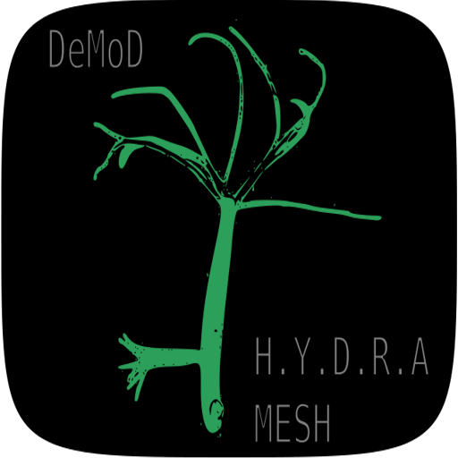
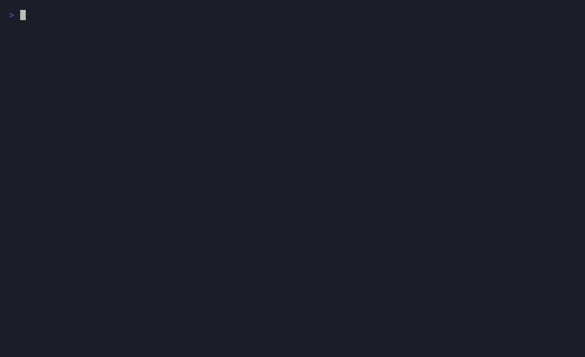

# HydraMesh




**0.x — pre-release, in active development**
**Developed by DeMoD LLC**  
**Contact:** alh477@demod.ltd 

[](https://github.com/ALH477/HydraMesh/actions/workflows/wire-certify.yml)
[](https://www.gnu.org/licenses/lgpl-3.0)


> **Status, honestly.** HydraMesh is **pre-1.0**. The project does not yet ship
> "11 production-ready language bindings." What is real today is the **wire
> quantum** and its cross-language **certificate**, green in CI for a small set of
> implementations. See the [language status tiers](#language-status) below for
> exactly what is certified, what is design-complete, and what is still an
> experimental stub. Version 1.0.0 is reserved for when the advertised set is
> green in CI.

https://github.com/user-attachments/assets/4f167206-7c25-4f70-b277-4f23d707cb7f

## Overview
HydraMesh is a free and open-source software (FOSS) framework evolved from the DeMoD Secure Protocol, designed for low-latency, modular, and interoperable data exchange. It targets applications like IoT messaging, real-time gaming synchronization, distributed computing, and edge networking. HydraMesh features a handshakeless design and a compatibility layer for UDP, TCP, WebSocket, and gRPC transports, aiming at peer-to-peer (P2P) networking with self-healing redundancy.

The one invariant that is real and certified today is the **wire quantum**: the 17-byte `DeModFrame`. Everything else — audio, game state, transports — is an *adapter* over it, and the cross-language **certificate** (`Documentation/golden_vectors.json`) is the contract that keeps the implementations byte-identical. The linkable library is **LGPL-3.0**; GPL-3.0 is scoped to the bundled DOOM example only.

The framework is intended to be hardware- and language-agnostic across embedded devices (e.g., Raspberry Pi), cloud servers, and mobile platforms. The breadth of that intent is not the breadth of what ships today — see the status tiers immediately below for the truthful, per-language state. Higher-level features (CLI, TUI, AUTO mode, master-node role assignment, Dijkstra routing, AI-driven topology) are **planned**, not present in the current release (see [`Documentation/DCF_CODE_REVIEW.md`](Documentation/DCF_CODE_REVIEW.md), item D1).


## Language status

HydraMesh is implemented across many languages, but they are at very different
levels of maturity. A language is only an **advertisable binding** once its
wire codec is golden-vector-verified in CI. Each language **graduates to
"Certified" when its `certify-<lang>` CI job goes green** ([`wire-certify.yml`](.github/workflows/wire-certify.yml)).

| Tier | Languages | What it means |
|------|-----------|---------------|
| **Certified** | **C** (`C_SDK/`), **Rust** (`codec/`), **Python** (`python/MCP/`, the reference), **Lua** (`GUI/wirelab.lua` + `lua/`), **Go** (`go/`), **Java** (`java/com/demod/dcf/`), **Node.js** (`JS/nodejs/`), **Perl** (`perl/`), **C++** (`cpp/include/dcf/`) | Golden-vector wire codec. C/Rust/Python/Lua are **green in CI today**; Go, Java, Node.js, Perl, and C++ each certify all 246 vectors via `certify-go`/`-java`/`-node`/`-perl`/`-cpp`. **Go has now graduated from a wire codec to a full stdlib-only SDK** — certified wire + game/audio/text adapters and a UDP `DcfNode` (`go/node`), with `certify-go` running `go vet`, `go test ./...`, and `go test -race ./node/`. These are the only implementations you should treat as bindings. Lua additionally certifies the audio L2 framing. |
| **Design** | **Haskell** (`haskell/`), **Kotlin** (`kotlin/`), **Swift** (`swift/`), **Lisp** (`lisp/`) | Full codec + cert with a CI job, but **not yet proven green** here (no GHC/kotlinc/swift/sbcl in the dev env to pre-verify): Haskell has `certify-haskell`; Kotlin has `certify-kotlin` (a Gradle module with a UDP `DcfNode.kt`); Swift has `certify-swift` (a SwiftPM package + XCTest cert); Lisp has `certify-lisp` (a dependency-free `lisp/src/wire.lisp` under bare SBCL) plus a load-time self-cert and the folded C7–C9 fixes. Promising, not yet certified. |
| **Experimental — building** | _(none)_ | Every advertised language now has a wire codec — see the Certified and Design tiers above. |

> The C SDK is intentionally narrow: only four modules compile and ship
> (`dcf_platform`, `dcf_error`, `dcf_ringbuf`, `dcf_connpool`). See
> [`C_SDK/README.md`](C_SDK/README.md).

## Quick start

**New here?** HydraMesh has one invariant — the 17-byte `DeModFrame` wire quantum —
and everything else (audio, game, transports) is an *adapter* over it, kept honest
by a cross-language **certificate**. The fastest "it works" is a green cert run:

```bash
git clone --recurse-submodules https://github.com/ALH477/DeMoD-Communication-Framework.git
cd DeMoD-Communication-Framework

# 1. Get a toolchain — pick ONE:
nix develop                  # all toolchains in one shell (recommended); or
./install_deps.sh            # distro-aware native install (Debian/Arch/Fedora); or
docker build -t hydramesh .  # everything in a container

# 2. First success — certify the wire codec across Python + Rust + C:
make certify                 # see `make help` for setup / test / docs / client
```

`make help` lists every task. Read these first — they are normative:

- [`Documentation/WIRE_QUANTUM_SPEC.md`](Documentation/WIRE_QUANTUM_SPEC.md) — the 17-byte frame format.
- [`Documentation/DCF_AUDIO_SPEC.md`](Documentation/DCF_AUDIO_SPEC.md) — collaborative audio as an adapter over it.
- [`Documentation/DCF_SNAKE_SPEC.md`](Documentation/DCF_SNAKE_SPEC.md) — synchronized studio audio snake over cat5e (quanta record + PCM cue planes to a mixer).
- [`ARCHITECTURE.md`](ARCHITECTURE.md) — the map of the repo (what ships, what's experimental).
- [`CONTRIBUTING.md`](CONTRIBUTING.md) — how to build, test, and open a PR (the certificate is the contract).

The bash scripts (`install_deps.sh`, `*-edit-gen.sh`) and `flake.nix` / `Dockerfile`
bootstrap your environment. See **Installation** below for per-language prerequisites.


### HYDRA Acronym
The name **HydraMesh** expresses the **design goals**: a self-healing, decentralized mesh with proxy-like adaptability. The acronym **HYDRA** stands for the target architecture — several rows below are **planned**, not present in the current release (see [`Documentation/DCF_CODE_REVIEW.md`](Documentation/DCF_CODE_REVIEW.md), item D1):

| Letter | Meaning | Feature | Description | Status |
|--------|---------|---------|-------------|--------|
| **H** | **Highly** | Performance | Low overhead handshakeless wire quantum, aimed at gaming and real-time apps. | wire codec certified |
| **Y** | **Yielding** | Adaptive Routing | AI-driven topology optimization using Dijkstra and RTT-based grouping. | **planned** |
| **D** | **Decentralized** | P2P Mesh | No single point of failure; AUTO mode for dynamic role switching. | P2P present; AUTO mode **planned** |
| **R** | **Resilient** | Self-Healing | Automatic failover and redundancy. | **planned** |
| **A** | **Adaptive** | Proxy Middleware | Plugin system and transport switching (e.g., gRPC, LoRaWAN) for flexible data relay. | partial / in progress |

> **Important**: HydraMesh complies with U.S. export regulations (EAR and ITAR). It avoids encryption to remain export-control-free. Users must ensure custom extensions comply; consult legal experts for specific use cases. DeMoD LLC disclaims liability for non-compliant modifications.

## Features

Present today (certified or shipping):
- **Certified wire quantum**: the 17-byte `DeModFrame`, byte-identical across the [Certified-tier languages](#language-status) and pinned by a 246-vector golden certificate that CI diffs on every push.
- **Adapters over the quantum**: DCF-Audio (collaborative audio) and DCF-Game (game state/events), both fragmented over ordinary frames. For audio, **only the L2 framing, the PCM-diag codec bytes, and the PM parameter layout are byte-certified — Opus output and PM synthesis audio are NOT byte-certified.**
- **SuperPack (opt-in, lower-latency for paired sends)**: a container that packs **two** 17-byte frames into **one 32-byte** message under a single joint CRC (`34 → 32` bytes, stronger integrity). When you are already sending frames in pairs it ships them as **one datagram instead of two** — one IP/UDP header, one syscall, one packet — so paired traffic crosses the network with strictly lower per-pair overhead and latency than two separate frames. `unpack` rebuilds both frames bit-exact, so the wire certificate is untouched; **certified byte-for-byte in every wire-codec language**. See [`Documentation/SUPERPACK_SPEC.md`](Documentation/SUPERPACK_SPEC.md).
- **Mesh nodes in six languages**: Go, Rust, and **C** speak a common **ProtoMessage/UDP** envelope (they mesh with each other); Python and Node.js share a **bare-frame + SuperPack/UDP** dialect; and **C++** is a **gRPC** node (bidirectional `MeshStream` of frames + SuperPacks + adapters, health + reflection). All ship as hermetic Nix-built Docker images (`alh477/dcf-{go,rs,c,cpp,python,nodejs}`) and are exercised together by `docker/mesh-interop-test.sh`.
- **DCF Modem (C, "modulations across quanta mediums")**: the C node also carries frames over a **Faust-DSP modem** — FSK / OOK / PSK / QAM — across a physical medium (loopback/file now, live audio behind `DCF_MODEM_AUDIO`). The byte↔symbol mapping is **certified across Python/Rust/C**; the waveform is loopback-tested (same policy as DCF-Audio synthesis). See [`Documentation/DCF_MODEM_SPEC.md`](Documentation/DCF_MODEM_SPEC.md).
- **HydraModem (acoustic M-FSK PHY, `hydramodem/`)**: a self-contained LGPL-3.0 C library (relicensed from Apache-2.0 on integration) that carries the 17-byte frame over **sound** with a real receiver — continuous-phase **M-FSK**, preamble/sync acquisition, **symbol-timing recovery (±3000 ppm)**, soft-Viterbi conv FEC + interleaver, and a streaming RX. A transport *beneath* the quantum (carries the frame opaquely, wire certificate untouched; CRC anchor `0x29B1`). Its **physical layer is authored in Faust** — the CPFSK modulator and quadrature demod bank are the normative `.dsp` — with a **byte-identical C reference DSP** as the default build and a **compiled-Faust backend** (`nix build .#hydramodem-faust`; version-tolerant across **Faust 2.72–2.85**) verified equivalent: cross-decoded both ways and matched over the cable. Its default 1000-baud profile is a near-field/cabled link and its timing recovery handles two interfaces' independent sample clocks — proven over real hardware (two cross-cabled USB interfaces, **PER 0% over 200 frames each way, full-duplex 0 crosstalk**, via `hydramodem/dcf-tools/`). `nix build .#hydramodem`.
- **Synchronized studio audio snake over cat5e (DCF-Snake)**: a star of source nodes → one **"mixer"** hub over dual cat5e, for studio multitrack capture + low-latency monitoring. Two planes, both adapters over the quantum: a **record plane** carrying the DeMoD **quanta** codec's QSS stream (`CTRL(3)` 5:11, ≤8188 B/msg) and a bidirectional low-latency **PCM cue plane** (`CTRL(3)` 9:7, ≤508 B/block), locked to a `BEACON(2)` grandmaster media clock (spoke PI servo + mixer per-source ASRC). A new **raw-L2 Ethernet transport** (AF_PACKET, custom EtherType, SuperPack-batched) rides beneath — no IP/UDP. **Byte-certified across Python/C/Rust**: both L2 framings, the clock payload, and `unwrap_pid`; **NOT byte-certified** (float, same policy as Opus/PM synthesis): quanta QSS audio, ASRC, PLC, and the cue-mix. quanta shells out as a *subprocess* (`nix build .#quanta`, GPL-3.0) kept out of the LGPL closure. See [`Documentation/DCF_SNAKE_SPEC.md`](Documentation/DCF_SNAKE_SPEC.md).
- **Sensor telemetry over a wire (DCF-Sense)**: a configurable layer for many sensor nodes → one gateway over a wired audio-band HydraModem link (greenhouses, etc.). One reading = one bare frame (`src_id`=node, 4-byte scaled payload); a configurable **MAC** (`tdma`/`dedicated`/`csma`/`fdma`) handles the shared medium since a PHY has none. An adapter over the quantum (certificate untouched). Runs over real HydraModem (subprocess or in-process ctypes transport), FDMA multiplies capacity, mesh relays via the bridge, and a portable C node decodes in the Python gateway — all at PER 0% on the bench (`python/dcf/sense/`). See [`Documentation/DCF_SENSE_SPEC.md`](Documentation/DCF_SENSE_SPEC.md).
- **Interoperates with JANUS (NATO STANAG 4748)**: a `janus:` transport carries the 17-byte frame as JANUS **cargo** over the ratified underwater-acoustic standard (FH-BFSK + conv FEC), so a DCF mesh can exchange frames with real JANUS gear. It shells out to the **GPL-3.0** janus-c reference as a *separate process* (never linked), keeping the LGPL library clean; an optional `nix build .#janus-c` dependency that CI skips when absent. A transport beneath the quantum (frame opaque, certificate untouched) — verified byte-exact round-trip via the standard encoder/decoder. See [`Documentation/DCF_JANUS_SPEC.md`](Documentation/DCF_JANUS_SPEC.md).
- **Runs over UDP _or_ radio (DCF-SDR + FEC)**: a complex-baseband IQ modem (GFSK / QPSK / 16-QAM / OOK·AM / AFSK-over-FM) carries frames to a **SoapySDR** device (HackRF / RTL-SDR / Pluto / LimeSDR) or a hardware-agnostic `.cf32` file, made reliable by a **systematic Reed-Solomon + interleaver FEC** that _corrects_ the bit errors a lossy RF/acoustic link injects (not just CRC-detects them). The **RS-FEC bytes are certified byte-for-byte in all 13 wire-codec languages**; the IQ waveform is loopback-tested. See [`Documentation/DCF_SDR_SPEC.md`](Documentation/DCF_SDR_SPEC.md) and [`Documentation/DCF_FEC_SPEC.md`](Documentation/DCF_FEC_SPEC.md).
- **Handshakeless, encryption-free design**: low-overhead framing for real-time use; encryption-free by design for EAR/ITAR export compliance.
- **LangGraph multi-agent system (`langgraph_agents/`)**: LLM-powered agents that communicate over the DCF mesh via MCP tools. Pluggable backends (echo, Grok, GLM-5p2 via Fireworks), coordinator-based routing to specialist subgraphs, UTF-8-safe streaming bridge for DCF-Text chunking, and a Rich-powered CLI + Textual TUI with Sierpinski greeting banner. Encryption-free for export control purposes — agents communicate over the same plaintext DCF transport, not a separate encrypted channel.
- **Open Source**: LGPL-3.0 (library) ensures transparency and community contributions.

Planned / in progress (design goals, not the current release):
- **Modularity & plugins**: standardized APIs and a plugin system for custom extensions — *partial / in progress*.
- **Transport flexibility**: a compatibility layer for UDP, TCP, WebSocket, gRPC, and custom transports — *in progress*; full cross-language interoperability tracks the [language tiers](#language-status).
- **Dynamic Role Assignment**: AUTO mode and master-node control with AI-driven network optimization — **planned**.
- **Usability**: CLI for automation and TUI for monitoring — **planned**.
- **Self-Healing P2P**: redundant paths, failure detection, RTT-based grouping, and Dijkstra routing with RTT weights — **planned** (see `Documentation/DCF_CODE_REVIEW.md`, item D1).
- **Persistence**: **StreamDB** is **Lisp-SDK-only and experimental** (a Rust embedded key-value store via CFFI); extensions to other SDKs are aspirational, not shipping.

## Architecture

```mermaid
graph TD
    A[HydraMesh Framework] --> B[CLI]
    A --> C[TUI]
    A --> D[Networking Layer]
    
    D --> E[Server Mode]
    D --> F[Client Mode]
    D --> G[P2P Mode]
    D --> H[AUTO Mode]
    H --> I[Master Node]
    I --> J[Role Assignment]
    I --> K[Config Management]
    I --> L[Metrics Collection]
    G --> M[Self-Healing Redundancy]
    M --> N[Peer Discovery]
    M --> O[Failure Detection]
    M --> P[RTT-Based Grouping]
    
    D --> Q[Transport Layer]
    Q --> R[WebSocket]
    Q --> S[UDP]
    Q --> T[TCP]
    Q --> U[gRPC]
    Q --> V[Custom Plugins]
    
    D --> W[Protocol Buffers]
    W --> X[Serialization/Deserialization]
    
    A --> Y[Language Bindings]
    Y --> Z[Perl]
    Y --> AA[Python]
    Y --> AB[C/C++]
    Y --> AC[Node.js]
    Y --> AD[Go]
    Y --> AE[Rust]
    Y --> AF[Java/Kotlin]
    Y --> AG[Swift]
    Y --> AH[Lisp]
    
    A --> AI[Platform Support]
    AI --> AJ[Embedded Devices]
    AI --> AK[Cloud Servers]
    AI --> AL[Mobile: Android/iOS]
    
    A --> AM[SDKs]
    AM --> AN[C SDK]
    AM --> AO[HydraMesh-Lisp SDK]
    AM --> AP[Future SDKs: Python, Perl, etc.]
    
    A --> AQ[Persistence Layer]
    AQ --> AR[StreamDB] 
```


## Collaborative Audio (DCF-Audio)

HydraMesh carries real-time, collaborative audio (jamming, talkback) over the mesh
**without a new wire format**: a 20 ms codec block is an adapter over the 17-byte
`DeModFrame`, serialised into a short burst of ordinary `CTRL` frames. The framing
layer (L2) is codec-agnostic and **byte-certified across C, Rust, and Python** — the
same way the wire quantum is. **Scope of "certified" here is exact: only the L2
framing, the PCM-diag codec bytes, and the PM parameter layout are byte-certified.
Opus output and PM (phase-mod) synthesis audio are NOT byte-certified.** See
[`Documentation/DCF_AUDIO_SPEC.md`](Documentation/DCF_AUDIO_SPEC.md).

Three codecs sit behind a `codec_id` registry:

| id | Codec | Use | Notes |
|----|-------|-----|-------|
| 0 | **Opus** | broadband collaboration | ~24 kbps; needs libopus (gated behind `--features opus`); output not byte-certified |
| 1 | **PCM-diag** | LAN / debug reference | 6 kHz 8-bit; byte-deterministic and byte-certified |
| 2 | **Faust phase-mod** | musical / instrument | resynthesises timbre from an 8-byte param block (gated behind `--features pm`); param layout certified, synthesis audio not |

Run the headless 2-peer loopback jam (latency / packet-loss / SNR report):

```bash
cd codec && cargo run --example jam_loopback -- --codec pcm          # default, no deps
cd codec && cargo run --example jam_loopback -- --codec pcm --loss 0.05   # exercise PLC
```

Certify an audio implementation against the golden vectors:

```bash
python3 python/MCP/gen_audio_vectors.py /tmp/audio_vectors.json   # regenerate + verify laws
cd codec && cargo test --test certify_audio                       # Rust
gcc -std=c11 -I codec C_SDK/tests/test_audio_certify.c -lm -o /tmp/ac && /tmp/ac   # C
```

## Over the air (DCF-SDR + FEC)



*(regenerate with `nix run nixpkgs#vhs -- Documentation/media/dcf-sdr-demo.tape` from `nix develop .#sdr`.)*

HydraMesh isn't tied to IP. The **same 17-byte `DeModFrame`** that meshes over UDP can
cross **real radio** — two laptops + two ~$25 RTL-SDRs, no internet — because two
adapters sit under the socket:

- **DCF-FEC** — a systematic **Reed-Solomon** code over GF(2⁸) (+ a block interleaver for
  RF bursts) that **corrects** the byte-errors a lossy link injects, where the frame CRC
  only detects them. The RS bytes are **certified byte-for-byte in all 13 wire-codec
  languages** (like SuperPack); see [`Documentation/DCF_FEC_SPEC.md`](Documentation/DCF_FEC_SPEC.md).
- **DCF-SDR** — an IQ modem (`python/modem/iq.py`) that renders FEC-coded frames to
  complex baseband — **GFSK / QPSK / 16-QAM / OOK·AM / AFSK-over-FM** — for a SoapySDR
  device or a `.cf32` file. The byte↔symbol map is certified (Python/Rust/C); the
  waveform is loopback-tested. See [`Documentation/DCF_SDR_SPEC.md`](Documentation/DCF_SDR_SPEC.md).

Send a frame over the air (or to a file) and recover it — no hardware needed for the
`.cf32` path:

```bash
nix develop .#sdr                                                   # faust + rtl-sdr + hackrf + soapysdr
python3 python/modem/sdr.py tx --text "DCF!" --mod gfsk --iq /tmp/d.cf32
python3 python/modem/sdr.py rx --iq /tmp/d.cf32 --mod gfsk          # → recovers "DCF!", CRC valid

# real radio (TX needs a license / ISM band):
python3 python/modem/sdr.py tx --text "DCF!" --soapy driver=hackrf --freq 433.9M --rate 2M
python3 python/modem/sdr.py rx --soapy driver=rtlsdr --freq 433.9M --rate 2M --secs 3
# .cf32 also pipes straight into rtl_sdr / hackrf_transfer / GNU Radio.
```

See the whole pipeline — including FEC recovering a frame a raw link would drop — with
the one-command demo:

```bash
bash python/modem/demo.sh
```

**Going to the field** (hiking, search & rescue, disaster aid, firefighting, hunting,
paintball/airsoft, marathon)? [`Documentation/DCF_FIELD_USE.md`](Documentation/DCF_FIELD_USE.md)
covers the handheld-radio profile (mid-band AFSK → MSK/4-FSK, RS-FEC), the
uplink-oriented mesh (route to whoever has the Starlink — `python3 python/modem/uplink_demo.py`),
a tiered field-test methodology, and the legal/safety rules.

> **Plaintext on the air.** The DCF wire is encryption-free by design (EAR/ITAR
> compliance), and **RF has no WireGuard** — anything you transmit is a broadcast. Treat
> an over-the-air link as public; apply operator-supplied, export-compliant crypto
> *above* the frame if you need confidentiality ([`Documentation/DCF_SECURITY_EXPOSURE.md`](Documentation/DCF_SECURITY_EXPOSURE.md)).

## Installation
Clone the repository with submodules:
```bash
git clone --recurse-submodules https://github.com/ALH477/DeMoD-Communication-Framework.git
cd DeMoD-Communication-Framework
```

### Prerequisites
- **Perl**: CPAN modules: `JSON`, `IO::Socket::INET`, `Getopt::Long`, `Curses::UI`, `Google::ProtocolBuffers::Dynamic`, `Grpc::XS`, `Module::Pluggable`.
- **Python**: `pip install protobuf grpcio grpcio-tools importlib`.
- **C SDK**: `libprotobuf-c`, `libuuid`, `libdl`, `libcjson`, `cmake`, `ncurses`.
- **C++**: `grpc`, `protobuf`.
- **Node.js**: `grpc`, `protobufjs`.
- **Go**: none — the Go SDK (`go/`) is **stdlib-only** (no `go get`, no `go.sum`).
- **Rust**: `tonic`, `prost` (for gRPC/Protobuf).
- **Java/Kotlin (Android)**: `io.grpc:grpc-okhttp`, `com.google.protobuf:protobuf-java`.
- **Swift (iOS)**: `GRPC-Swift`, `SwiftProtobuf`.
- **Lisp**: SBCL with Quicklisp; dependencies: `cl-protobufs`, `cl-grpc`, `cffi`, etc. (see `lisp/src/hydramesh.lisp`).
- **StreamDB**: Build `libstreamdb.so` from `streamdb/` using Cargo for persistence in HydraMesh-Lisp SDK.

### Generating Protobuf/gRPC
Use `protoc` to generate bindings for each language:
- **Perl/Python**: `protoc --perl_out=perl/lib --python_out=python/dcf --grpc_out=python/dcf --plugin=protoc-gen-grpc_python=python -m grpc_tools.protoc messages.proto services.proto`
- **C SDK**: `protoc --c_out=c_sdk/src messages.proto`
- **C++**: `protoc --cpp_out=cpp/src --grpc_out=cpp/src --plugin=protoc-gen-grpc=grpc_cpp_plugin messages.proto services.proto`
- **Node.js**: `protoc --js_out=import_style=commonjs:nodejs/src --grpc_out=nodejs/src --plugin=protoc-gen-grpc=grpc_node_plugin messages.proto services.proto`
- **Go**: `protoc --go_out=go/src --go-grpc_out=go/src messages.proto services.proto`
- **Rust**: Use `tonic-build` in `build.rs`
- **Android**: `protoc --java_out=android/app/src/main --grpc_out=android/app/src/main --plugin=protoc-gen-grpc-java=grpc-java-plugin messages.proto services.proto`
- **iOS**: `protoc --swift_out=ios/Sources --grpc-swift_out=ios/Sources messages.proto services.proto`
- **Lisp**: `protoc --lisp_out=lisp/src messages.proto services.proto`

### Building SDKs
- **C SDK**: `cd c_sdk && mkdir build && cd build && cmake .. && make`
- **Perl**: `cpanm --installdeps .`
- **Python**: `pip install -r python/requirements.txt`
- **Lisp**: Load via SBCL: `(load "lisp/src/hydramesh.lisp")`
- **Others**: Follow language-specific build tools (e.g., `cargo build` for Rust).


## Examples

> **These snippets illustrate the *intended* gRPC API surface, not the certified
> reality.** Across all languages, the gRPC
> bindings are sketches and depend on generated code that does not ship today;
> treat them as design intent. Only the [Certified-tier](#language-status)
> wire-codec entry points are guaranteed. The C example below is corrected to use
> the modules that actually compile.

### Perl (gRPC Client, illustrative / experimental)
```perl
# perl/hydramesh.pl
use Grpc::XS;
use HydraMesh::Messages qw(HydraMeshMessage);
my $client = Grpc::XS::channel('localhost:50051');
my $stub = $client->service('HydraMeshService');
my $request = HydraMeshMessage->new(data => 'Hello');
my $response = $stub->SendMessage($request);
print $response->{data}, "\n";
```

### Python (gRPC Client)
```python
# python/hydramesh.py
import grpc
from hydramesh.services_pb2_grpc import HydraMeshServiceStub
from hydramesh.messages_pb2 import HydraMeshMessage
channel = grpc.insecure_channel('localhost:50051')
stub = HydraMeshServiceStub(channel)
request = HydraMeshMessage(data='Hello')
response = stub.SendMessage(request)
print(response.data)
```

### C SDK (shipping modules)

> The high-level client API (`hydramesh_client_*` / `dcf_client_*`) lives under
> `C_SDK/include/experimental/` and **does not compile or ship**. The C SDK that
> builds today is the four-module spine (`dcf_platform`, `dcf_error`,
> `dcf_ringbuf`, `dcf_connpool`). The example below uses only shipping symbols;
> see [`C_SDK/README.md`](C_SDK/README.md) for more.

```c
// Connection pool with circuit breaker (shipping API)
#include <dcf/dcf_connpool.h>

DCFConnPoolConfig cfg = DCF_CONNPOOL_CONFIG_DEFAULT;
cfg.factory = my_connection_factory;
cfg.max_connections = 100;
cfg.circuit.failure_threshold = 5;

DCFConnPool* pool = dcf_connpool_create(&cfg);
dcf_connpool_start(pool);

DCFPooledConn* conn = dcf_connpool_acquire(pool, "server1", 5000);
if (conn) {
    /* use connection... */
    dcf_connpool_release(pool, conn, true);
}
dcf_connpool_destroy(pool, true);
```

### C++ (gRPC Server)
```cpp
// cpp/src/hydramesh.cpp
#include <grpcpp/grpcpp.h>
#include "services.grpc.pb.h"
class ServerImpl final : public HydraMeshService::Service {
    grpc::Status SendMessage(grpc::ServerContext* context, const HydraMeshMessage* request, HydraMeshMessage* response) override {
        response->set_data("Echo: " + request->data());
        return grpc::Status::OK;
    }
};
int main() {
    grpc::ServerBuilder builder;
    builder.AddListeningPort("0.0.0.0:50051", grpc::InsecureServerCredentials());
    ServerImpl service;
    builder.RegisterService(&service);
    std::unique_ptr<grpc::Server> server(builder.BuildAndStart());
    server->Wait();
    return 0;
}
```

### Node.js (gRPC Client)
```javascript
// nodejs/src/hydramesh.js
const grpc = require('@grpc/grpc-js');
const protoLoader = require('@grpc/proto-loader');
const packageDefinition = protoLoader.loadSync(['messages.proto', 'services.proto']);
const hydrameshProto = grpc.loadPackageDefinition(packageDefinition).hydramesh;
const client = new hydrameshProto.HydraMeshService('localhost:50051', grpc.credentials.createInsecure());
const request = { data: 'Hello', recipient: 'peer1' };
client.sendMessage(request, (err, response) => {
  if (err) console.error(err);
  console.log(response.data);
});
```

### Go (DCF node — real, stdlib-only)
The Go SDK (`go/`) is a working, certified, **stdlib-only** node — no gRPC, no codegen.
One `SendTextDCF` call fragments a message into certified 17-byte `DeModFrame` frames and
ships them over UDP; the receiver reassembles them. See `go/README.md`.
```go
package main

import (
    "log"
    "net"
    "time"

    "github.com/ALH477/HydraMesh/go/node"
    "github.com/ALH477/HydraMesh/go/text"
)

// Embed DefaultMessageHandler; override only the arms you care about.
type app struct {
    node.DefaultMessageHandler
    n     *node.DcfNode
    reasm *text.TextReassembler
}

func (a *app) HandleText(payload []byte, from *net.UDPAddr) {
    if pkt := a.n.ReassembleTextPayload(a.reasm, payload); pkt != nil {
        log.Printf("text from %s on ch %d: %q", from, pkt.Dst, pkt.Text)
    }
}

func main() {
    cfg := node.DefaultConfig() // UDP, p2p, 0.0.0.0:7777
    n, err := node.New(&cfg)
    if err != nil {
        log.Fatal(err)
    }
    if err := n.Start(&app{n: n, reasm: text.NewTextReassembler()}); err != nil {
        log.Fatal(err) // launches the receiver + ping + ARQ goroutines
    }
    defer n.Stop()

    n.AddPeer("peer1", "192.168.1.50", 7777)
    ch := text.ChannelID("lobby") // crc16 of the channel name
    n.SendTextDCF([]byte("hello over DeModFrame"), 1, uint32(time.Now().UnixMicro()), 1, ch, 0, true)
    time.Sleep(2 * time.Second)
}
```

### Rust (gRPC Server)
```rust
// rust/src/main.rs
use tonic::{transport::Server, Request, Response, Status};
use services::hydramesh_service_server::{HydraMeshService, HydraMeshServiceServer};
use services::{HydraMeshMessage};
#[derive(Default)]
pub struct Networking {}
#[tonic::async_trait]
impl HydraMeshService for Networking {
    async fn send_message(&self, request: Request<HydraMeshMessage>) -> Result<Response<HydraMeshMessage>, Status> {
        let reply = HydraMeshMessage { data: format!("Echo: {}", request.into_inner().data) };
        Ok(Response::new(reply))
    }
}
#[tokio::main]
async fn main() -> Result<(), Box<dyn std::error::Error>> {
    let addr = "[::1]:50051".parse()?;
    let net = Networking::default();
    Server::builder().add_service(HydraMeshServiceServer::new(net)).serve(addr).await?;
    Ok(())
}
```

### Lisp (gRPC Client with StreamDB)
```lisp
;; lisp/src/hydramesh.lisp (excerpt)
(in-package :hydramesh)
(hydramesh-init "config.json" :restore-state t)
(hydramesh-start)
(hydramesh-quick-send "Hello from Lisp!" "localhost:50052")
(hydramesh-db-insert "/test/key" "test data")  ; Store in StreamDB
(print (hydramesh-db-query "/test/key"))  ; Query from StreamDB
(hydramesh-stop)
```

### Android (Kotlin Client)
```kotlin
// android/app/src/main/kotlin/com/example/hydramesh/HydraMeshClient.kt
import io.grpc.ManagedChannelBuilder
import com.example.hydramesh.services.HydraMeshServiceGrpc
import com.example.hydramesh.messages.HydraMeshMessage
class HydraMeshClient(host: String, port: Int) {
    private val channel = ManagedChannelBuilder.forAddress(host, port).usePlaintext().build()
    private val stub = HydraMeshServiceGrpc.newBlockingStub(channel)
    fun sendMessage(data: String, recipient: String): String {
        val request = HydraMeshMessage.newBuilder().setData(data).setRecipient(recipient).build()
        return stub.sendMessage(request).data
    }
}
```

### iOS (Swift Client)
```swift
// ios/HydraMeshClient.swift
import GRPC
import NIO
import SwiftProtobuf
class HydraMeshClient {
    private let connection: ClientConnection
    private let client: HydraMeshServiceClient
    init(host: String, port: Int) {
        let group = PlatformSupport.makeEventLoopGroup(loopCount: 1)
        connection = ClientConnection.insecure(group: group).connect(host: host, port: port)
        client = HydraMeshServiceClient(channel: connection)
    }
    func sendMessage(data: String, recipient: String) -> String? {
        var request = HydraMeshMessage()
        request.data = data
        request.recipient = recipient
        do {
            let response = try client.sendMessage(request).response.wait()
            return response.data
        } catch { return nil }
    }
}
```

### Plugin Example (C Transport for C SDK)
```c
// c_sdk/plugins/custom_transport.c
#include <hydramesh_sdk/hydramesh_plugin_manager.h>
typedef struct { /* Private data */ } CustomTransport;
bool setup(void* self, const char* host, int port) { return true; }
bool send(void* self, const uint8_t* data, size_t size, const char* target) { return true; }
uint8_t* receive(void* self, size_t* size) { *size = 0; return NULL; }
void destroy(void* self) { free(self); }
ITransport iface = {setup, send, receive, destroy};
void* create_plugin() { return calloc(1, sizeof(CustomTransport)); }
const char* get_plugin_version() { return "1.0"; }
```

## Configuration
Create `config.json` based on `config.json.example`. HydraMesh supports various optimization levels to balance performance, reliability, and resource usage:

- **High Optimization (Performance-Focused)**: Prioritizes speed with minimal overhead—uses lightweight transports (e.g., UDP), quick mode in StreamDB (skipping CRC checks for ~10x faster reads), and reduced logging. Suitable for high-throughput, low-latency applications like gaming, where data integrity is managed externally.
  ```json
  {
    "framework": "hydramesh",
    "transport": "udp",
    "host": "localhost",
    "port": 50051,
    "mode": "p2p",
    "node-id": "node-1",
    "peers": ["localhost:50052"],
    "group-rtt-threshold": 20,
    "storage": "streamdb",
    "streamdb-path": "dcf.streamdb",
    "log-level": 2
  }
  ```

- **Balanced Optimization (Default)**: Combines reliability and performance—uses gRPC for reliable delivery, standard StreamDB mode (with CRC checks), and info-level logging. Ideal for general-purpose applications like distributed computing.
  ```json
  {
    "framework": "hydramesh",
    "transport": "gRPC",
    "host": "localhost",
    "port": 50051,
    "mode": "auto",
    "node-id": "node-1",
    "peers": ["localhost:50052"],
    "group-rtt-threshold": 50,
    "storage": "streamdb",
    "streamdb-path": "dcf.streamdb",
    "log-level": 1
  }
  ```

- **Low Optimization (Reliability-Focused)**: Emphasizes data integrity and debugging—uses reliable transports (e.g., SCTP), disables quick mode in StreamDB for full CRC checks, and enables debug logging. Best for development or critical systems like IoT with intermittent connectivity.
  ```json
  {
    "framework": "hydramesh",
    "transport": "sctp",
    "host": "localhost",
    "port": 50051,
    "mode": "master",
    "node-id": "node-1",
    "peers": ["localhost:50052"],
    "group-rtt-threshold": 100,
    "storage": "streamdb",
    "streamdb-path": "dcf.streamdb",
    "log-level": 0
  }
  ```

For master node:
```json
{
  "framework": "hydramesh",
  "transport": "gRPC",
  "host": "localhost",
  "port": 50051,
  "mode": "master",
  "node-id": "master1",
  "peers": ["localhost:50052", "localhost:50053"],
  "group-rtt-threshold": 50,
  "storage": "streamdb",
  "streamdb-path": "dcf.streamdb"
}
```

## Testing

**The certificate is the test that matters.** The cross-language wire/audio/game
certs are what gate every push (`.github/workflows/wire-certify.yml`); run them
locally with `make certify` or directly:

```bash
python3 python/MCP/verify_laws.py /tmp/gv.json   # Python (reference) — regenerate + verify
cd codec && cargo test --test certify            # Rust
gcc -std=c11 -Wall -Wextra -I codec C_SDK/tests/test_wire_certify.c -lm -o /tmp/wc && /tmp/wc   # C
```

Per-language unit tests (where they exist):
- **C SDK**: `cd C_SDK && mkdir build && cd build && cmake .. && make && ctest` (the wire cert is `C_SDK/tests/test_wire_certify.c`; `tests/legacy/` is quarantined and not built).
- **Python**: `pytest python/tests/`.
- **Lisp**: `sbcl --non-interactive --load lisp/src/wire.lisp` certifies the wire codec (CI-gated via `certify-lisp`); the full SDK (`lisp/src/hydramesh.lisp`) self-certifies on load.
- **Go**: `cd go && go test ./...` — certifies the wire codec (246 golden vectors) plus the
  game/audio/text adapters, and exercises the stdlib-only UDP `DcfNode` SDK (ProtoMessage
  transport, peer RTT, reliable-ARQ) via a two-node loopback integration test.
- **Java**: `javac -d /tmp/jout java/com/demod/dcf/Frame.java java/com/demod/dcf/Certify.java && java -cp /tmp/jout com.demod.dcf.Certify` — certifies all 246 vectors.
- **Kotlin**: `cd kotlin && gradle run` (or the `certify-kotlin` CI job) — certifies the codec; CI-gated (no local kotlinc in the dev env).
- **Node.js**: `node JS/nodejs/test/certify.js` (or `npm --prefix JS/nodejs run certify`) — certifies all 246 vectors.
- **Perl**: `cd perl && prove -l t/` (or `perl Makefile.PL && make test`) — certifies all 246 vectors.
- **C++**: `g++ -std=c++17 -I cpp/include cpp/tests/certify.cpp -o cert && ./cert` (or `cmake . && ctest`) — certifies all 246 vectors.
- **Swift**: `cd swift && swift test` — certifies the codec (CI-gated via `certify-swift`; no local Swift toolchain in the dev env).
- **Integration** (RTT grouping, failover, AUTO-mode role assignment, StreamDB persistence): **planned**, not implemented in the current release.

### Enhanced Benefits of StreamDB Integration in HydraMesh-Lisp

> **Status:** StreamDB is **Lisp-SDK-only and experimental**. It is not
> battle-tested, not shipping in any other SDK, and not part of the certified
> wire path. The sections below describe its *intended* benefits and design, not
> a production guarantee.

As we continue building out the SDKs in the HydraMesh mono repository (https://github.com/ALH477/DeMoD-Communication-Framework), the integration of StreamDB into the HydraMesh-Lisp SDK is an experimental step toward persistent, embedded storage. StreamDB, a lightweight, embedded key-value database implemented in Rust, is currently exclusive to the HydraMesh-Lisp SDK, serving as a proof-of-concept for how HydraMesh can incorporate storage. This exclusivity lets us iterate in Lisp's expressive environment before any expansion to other SDKs (e.g., C, Python). Below, we iterate on StreamDB's design goals and benefits, with notes on its synergy with HydraMesh-Lisp's DSL features, while emphasizing DeMoD LLC's role in developing the only complete GPLv3 version to democratize bleeding-edge technology.

#### 1. **Superior Persistence for Fault-Tolerant Distributed Systems**
   - **Iteration**: Beyond basic state recovery, StreamDB's paged storage (4KB pages with chaining for up to 256MB documents) and reverse trie indexing enable efficient, prefix-based queries for hierarchical data (e.g., `/state/peers/node1/rtt`). In HydraMesh-Lisp, this means nodes can persist complex structures like peer groups or message logs atomically, reducing fragmentation and supporting up to 8TB databases—ideal for scaling HydraMesh networks.
   - **HydraMesh-Lisp Specific**: The DSL's macros (e.g., `def-hydramesh-plugin`) allow seamless wrapping of StreamDB operations, making persistence feel native (e.g., `hydramesh-db-insert "/metrics/sends" count`). This compactness (integrated in ~50 lines) enhances fault tolerance in AUTO mode, where dynamic role switches rely on quick state reloads from StreamDB.
   - **Democratization Angle**: DeMoD's GPLv3-complete version ensures open access to advanced features like automatic chain repair, empowering developers to build resilient systems without proprietary dependencies.

#### 2. **Ultra-Low-Latency Data Access for Real-Time Workloads**
   - **Iteration**: StreamDB's QuickAndDirtyMode (skipping CRC for ~10x faster reads, up to 100MB/s) and LRU caching complement HydraMesh-Lisp's sub-millisecond messaging, enabling near-instant access to cached states. New: In edge scenarios, StreamDB's no-mmap fallback ensures consistent performance on constrained hardware, with <1ms lookups for RTT metrics during peer grouping.
   - **HydraMesh-Lisp Specific**: Integrated directly into `hydramesh-node` (via `streamdb` slot), it caches results from `hydramesh-get-metrics` or `hydramesh-group-peers`, reducing I/O in high-frequency loops. Lisp's dynamic typing pairs with StreamDB's binary stream support for flexible data handling (e.g., storing serialized CLOS messages).
   - **Democratization Angle**: By open-sourcing the full GPLv3 implementation, DeMoD makes high-speed, embedded databases accessible, leveling the playing field for indie developers against proprietary solutions like Redis.

#### 3. **Modular Extensibility and Plugin Synergy**
   - **Iteration**: StreamDB's `DatabaseBackend` trait allows custom backends (e.g., in-memory for testing), extending HydraMesh-Lisp's plugin system. New: Middleware can hook into StreamDB operations (e.g., serialize data as JSON/CBOR before insert), creating a unified extension point for transports and storage.
   - **HydraMesh-Lisp Specific**: As a core backend (not a plugin, for tight coupling), it enhances modularity—e.g., `save-state` uses StreamDB paths like `/state/config`, queryable via `hydramesh-db-search "/state/"`. This integrates with transports (e.g., Serial for embedded), storing IoT data locally before syncing.
   - **Democratization Angle**: DeMoD's GPLv3 version includes pluggable backends, encouraging community extensions (e.g., S3 integration), fostering innovation in HydraMesh's ecosystem.

#### 4. **Optimized for Resource-Constrained Deployments**
   - **Iteration**: StreamDB's tunable parameters (e.g., page size, cache limits) and minimal dependencies make it perfect for HydraMesh-Lisp on devices like Raspberry Pi. New: Free page management (first-fit LIFO with consolidation) minimizes fragmentation, supporting long-running edge nodes with limited storage.
   - **HydraMesh-Lisp Specific**: The DSL's ~700-line efficiency pairs with StreamDB's lightweight footprint, enabling deployments on ARM-based IoT hardware. For example, persist sensor logs in StreamDB during offline periods, syncing via LoRaWAN when connected.
   - **Democratization Angle**: DeMoD's complete GPLv3 impl democratizes embedded databases, providing features like orphan collection without costly licenses, ideal for open hardware projects.

#### 5. **Seamless Cross-Language Interoperability**
   - **Iteration**: StreamDB's file-based storage and FFI (via `libstreamdb.so`) enable shared access across HydraMesh SDKs. New: HydraMesh-Lisp nodes can store JSON-serialized metrics in StreamDB, readable by C SDKs for hybrid networks.
   - **HydraMesh-Lisp Specific**: CFFI bindings in `hydramesh.lisp` expose StreamDB as DSL functions (e.g., `hydramesh-db-insert`), ensuring Lisp's dynamic features (e.g., macros) enhance interoperability without complexity.
   - **Democratization Angle**: As the only complete GPLv3 version (developed from Iain Ballard's incomplete C# repo), DeMoD's Rust impl promotes open access to advanced FFI-capable databases.

#### 6. **Robust Error Handling and Automated Recovery**
   - **Iteration**: StreamDB's CRC32 checks, version monotonicity, and recovery (e.g., index rebuild) bolster HydraMesh-Lisp's `hydramesh-error` handling. New: Integrates with failover (`hydramesh-heal`), recovering states from StreamDB after crashes.
   - **HydraMesh-Lisp Specific**: Errors from StreamDB are wrapped in `hydramesh-error`, logged via `log4cl`, and tested in FiveAM (e.g., `streamdb-integration-test`), ensuring resilience in P2P meshes.
   - **Democratization Angle**: GPLv3 ensures community-driven improvements to recovery, making reliable storage accessible for all.

#### 7. **Advanced Monitoring and Analytics**
   - **Iteration**: StreamDB stores historical metrics (e.g., `/metrics/sends`), enabling trend analysis. New: Prefix searches (`hydramesh-db-search "/metrics/"`) support AI optimization in Master mode.
   - **HydraMesh-Lisp Specific**: Enhances `hydramesh-get-metrics` by querying StreamDB, visualized in TUI or Graphviz.
   - **Democratization Angle**: DeMoD's open impl democratizes analytics-ready storage for edge AI.

#### 8. **Streamlined Testing and Validation**
   - **Iteration**: StreamDB's tests integrate with FiveAM, verifying persistence in network scenarios. New: Ensures data survives restarts, critical for AUTO mode.
   - **HydraMesh-Lisp Specific**: `streamdb-integration-test` validates CRUD and recovery, extending HydraMesh's testing.
   - **Democratization Angle**: GPLv3 fosters shared testing tools for reliable HydraMesh deployments.

### StreamDB's Exclusivity to HydraMesh-Lisp (For Now)
StreamDB is currently integrated only into the HydraMesh-Lisp SDK to prototype its benefits in Lisp's dynamic environment (e.g., macros for StreamDB wrappers). This allows rapid iteration on persistence features (e.g., message logging in `hydramesh-send`) before porting to other SDKs. Future plans include CFFI bindings for C SDK and Python wrappers, expanding StreamDB across the mono repo.

### DeMoD's GPLv3-Complete StreamDB: Democratizing Bleeding-Edge Tech
DeMoD LLC developed the only complete GPLv3 version of StreamDB from Iain Ballard's incomplete C# repo, reimplementing it in Rust for safety and performance. This ensures bleeding-edge features (e.g., trie indexing, MVCC-like versioning) are freely available, promoting open innovation in embedded storage and aligning with HydraMesh's FOSS ethos. By open-sourcing under GPLv3, DeMoD democratizes tech typically locked in proprietary systems, enabling developers to build advanced, cost-free solutions.

## LangGraph Multi-Agent System (`langgraph_agents/`)

The `langgraph_agents/` package adds LLM-powered agents that communicate over
the DCF mesh in realtime using the Model Context Protocol (MCP). Agents are
built as LangGraph state graphs (receive → route → process → respond) with
pluggable LLM backends and MCP tool wrappers for `mesh_send`, `mesh_recv`,
and `mesh_status`.

### Export control

The agent system is **encryption-free** for export control purposes. Agents
communicate over the same plaintext DCF transport — there is no separate
encrypted channel. This keeps the system within EAR/ITAR export compliance
boundaries. Any security layer is external to this package and connected
through IPC barriers.

### Architecture

```
mesh_recv → receive → route → process (LLM backend) → respond → mesh_send
                                                      ↑
                                         coordinator routes by prefix:
                                         echo:       → echo specialist
                                         summarize:  → summarizer specialist
                                         (default)   → echo
```

- **State graph**: LangGraph `StateGraph` with `AgentState` (messages, channel,
  sender, routing_decision, response, metadata).
- **LLM backends**: `echo` (test), `grok` (xAI), `glm5p2` (Fireworks GLM-5p2).
  Any OpenAI-compatible endpoint can be added.
- **MCP tools**: `MeshSendTool`, `MeshRecvTool`, `MeshStatusTool` — LangChain
  tool wrappers that call the MCP server over HTTP.
- **Streaming bridge**: chunks LLM responses to fit DCF-Text's per-message cap
  with UTF-8 boundary safety (never splits mid-character).
- **Coordinator graph**: prefix-based routing to specialist subgraphs. Add new
  specialists by registering a process function.

### CLI

```bash
# List configured agents
dcf-agent agents --config langgraph_agents/agents.jsonc

# List available LLM backends
dcf-agent backends

# One-shot: send a message, get response
dcf-agent chat --backend echo "hello mesh"
dcf-agent chat --graph coordinator "echo: test routing"

# Start the mesh poll loop (long-lived)
dcf-agent run --config langgraph_agents/agents.jsonc

# Query mesh endpoint status
dcf-agent status --mesh-url http://127.0.0.1:8765
```

Every CLI command prints a Sierpinski triangle greeting banner.

### TUI

```bash
dcf-agent tui --config langgraph_agents/agents.jsonc
```

Interactive Textual-based TUI with:
- Agent config sidebar (left)
- Message log (main panel, scrolling)
- Input bar — type a message, press Enter to process
- `Ctrl+B` — cycle LLM backend
- `Ctrl+G` — cycle graph type (base / coordinator)
- `Ctrl+S` — query mesh status
- `Ctrl+T` — toggle Sierpinski triangle display
- `Ctrl+C` — quit

### Nix integration

```bash
# Run the CLI or TUI directly
nix run .#agent -- backends
nix run .#agent-tui

# Dev shell with everything on PATH
nix develop .#agents
dcf-agent backends
dcf-agent-tui
```

### Configuration (`agents.jsonc`)

```jsonc
{
  "agents": [
    {
      "name": "echo-agent",
      "graph": "base",
      "llm_backend": "echo",
      "channel": "echo",
      "mesh_url": "http://127.0.0.1:8765"
    },
    {
      "name": "glm5p2-agent",
      "graph": "coordinator",
      "llm_backend": "glm5p2",
      "channel": "glm",
      "mesh_url": "http://127.0.0.1:8765"
    }
  ]
}
```

### Use cases

- **Disconnected/edge deployments**: agents communicate over UDP, acoustic,
  SDR, or any DCF transport — no internet required.
- **Multi-agent coordination**: a coordinator routes messages to specialists.
  Add translators, analysts, coders — they plug into the graph.
- **Pluggable LLM backends**: echo for testing, Grok via xAI, GLM-5p2 via
  Fireworks. Any OpenAI-compatible endpoint works.
- **Realtime mesh integration**: agents poll the mesh via MCP, process through
  a LangGraph state machine, and respond back. The streaming bridge chunks
  responses to fit DCF-Text's frame limit.
- **Export-compliant**: encryption-free by design. Safe for EAR/ITAR-regulated
  environments where cryptographic layers are restricted.

### Tests

```bash
cd langgraph_agents && pytest -v    # 48 tests
```

## Documentation

For comprehensive documentation on the HydraMesh Framework, including detailed SDK guides, API references, design specifications, and contribution processes, refer to the Sphinx-generated docs. These cover all SDKs in the mono repo (e.g., C SDK, Python, HydraMesh-Lisp, Rust) and are built from the Markdown/reST sources in `Documentation/`.

### Viewing the Documentation
- **Online**: Hosted on GitHub Pages at [https://alh477.github.io/DeMoD-Communication-Framework/](https://alh477.github.io/DeMoD-Communication-Framework/) (auto-built via CI/CD on pushes to `main`).
- **Locally**: Build the docs yourself (or run `make docs` from the repo root):
  ```bash
  cd Documentation
  pip install -r requirements.txt  # Install Sphinx, myst-parser, etc.
  make docs-html  # Generates HTML in Documentation/_build/html/
  open _build/html/index.html  # View in browser
  ```
- **Key Sections**:
  - [Design Specifications](https://alh477.github.io/DeMoD-Communication-Framework/specs/dcf_design_spec.html): Covers protocol design, AUTO mode, master node, plugins, and SDK guidelines.
  - [SDK Guides](https://alh477.github.io/DeMoD-Communication-Framework/guides/sdk-development.html): Tutorials for developing and integrating SDKs (e.g., C SDK with RTT grouping, HydraMesh-Lisp with StreamDB persistence).
  - [API References](https://alh477.github.io/DeMoD-Communication-Framework/api/index.html): Auto-generated from code comments/docstrings across languages (e.g., `hydramesh_client_send_message` in C, `hydramesh-quick-send` in Lisp).
  - [Contribution Guidelines](https://alh477.github.io/DeMoD-Communication-Framework/process/CONTRIBUTING.html): How to add new SDKs or plugins.

The docs support multi-format outputs (HTML, ePub) and include custom rendering for Protobuf schemas. For source, see the `Documentation/` directory in the repo. Contributions to improve docs are welcome—follow the style in `Documentation/dcf_design_spec.markdown`.

## Contributing
Contributions are welcome! See **[CONTRIBUTING.md](CONTRIBUTING.md)** for the full
workflow and **[ARCHITECTURE.md](ARCHITECTURE.md)** for the repo map. In short:
1. Fork the repo and branch off `main` (`git checkout -b feature/xyz`).
2. Add tests and code (follow style: `perltidy`, `black`, `ktlint`, `swiftformat`, `clang-format` for C, Lisp conventions for HydraMesh-Lisp).
3. **The certificate is the contract** — if you touch any codec, regenerate the golden vectors and run the certs (`make certify`); CI fails on drift.
4. Submit a PR using the [pull request template](.github/PULL_REQUEST_TEMPLATE.md).
5. Discuss issues via [GitHub Issues](https://github.com/ALH477/DeMoD-Communication-Framework/issues).
New and improved SDKs are encouraged. The bar for a language to graduate from
**Experimental** to **Certified** is concrete: its `certify-<lang>` CI job passes
the golden vectors. Higher-level features (RTT grouping, plugins, AUTO mode) are
planned and additive; LGPL-3.0 compliance is required.

# [DeMoD LLC](https://DeMoD.ltd) Cut the bullshit, Cut the price. Innovation without the overhead.

[](https://ko-fi.com/F1F11PNYX4)

```
  ___   _      _   _   ___  ____________          ______    ___  ___     ______   _      _     _____ 
 / _ \ | |    | | | | /   ||___  /___  /          |  _  \   |  \/  |     |  _  \ | |    | |   /  __ \
/ /_\ \| |    | |_| |/ /| |   / /   / /   ______  | | | |___| .  . | ___ | | | | | |    | |   | /  \/
|  _  || |    |  _  / /_| |  / /   / /   |______| | | | / _ \ |\/| |/ _ \| | | | | |    | |   | |    
| | | || |____| | | \___  |./ /  ./ /             | |/ /  __/ |  | | (_) | |/ /  | |____| |___| \__/\
\_| |_/\_____/\_| |_/   |_/\_/   \_/              |___/ \___\_|  |_/\___/|___/   \_____/\_____/\____/
```
